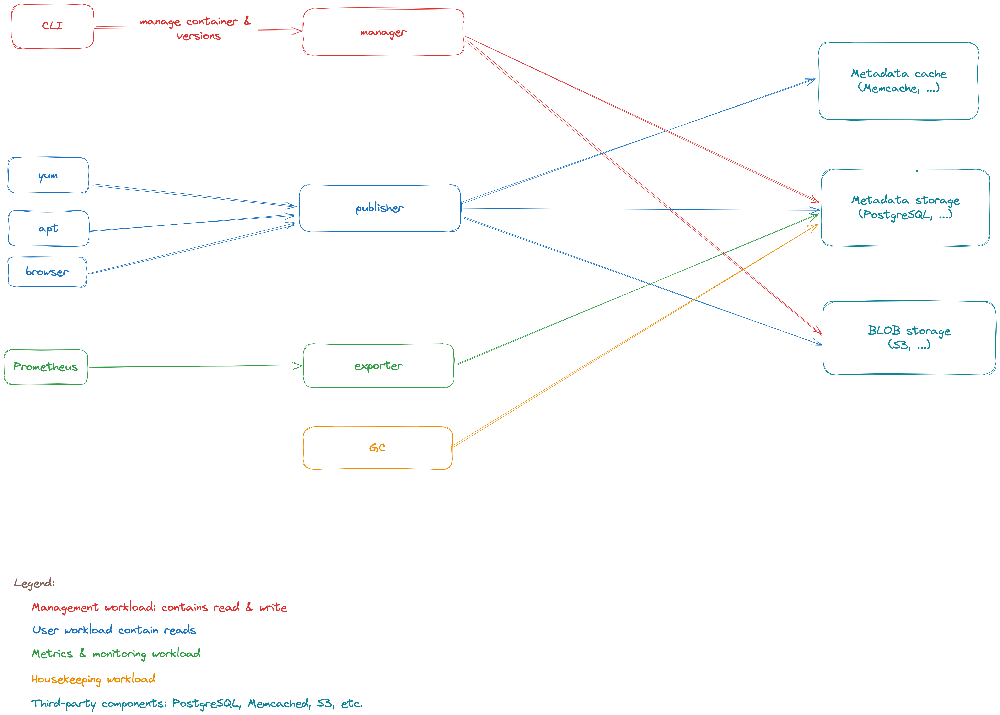

# archived

[](https://github.com/teran/archived/actions/workflows/verify.yml)
[](https://goreportcard.com/report/github.com/teran/archived)

Cloud native service to store versioned data in space-efficient manner

archived is applicable if you have amount of low-cardinality data to share
with amount of users/systems. Good example of that task: APT/RPM repository.

## Project status & roadmap

archived is under active development and almost everything is a subject
to change. MVP was already implemented as of v0.0.1 to prove all the concepts
used in archived.

The complete feature list is available in the [repository issues](https://github.com/teran/archived/issues)

## How it works

archived is inspired by `rsync --link-dest` which allowed to store package
mirrors without duplicating data for decades. And now archived makes this
approach unbound from local file systems by using modern era storage services
under the hood like S3.

To do so archived relies on two storages: metadata and CAS.

Metadata is a some kind of database to store all of the things:

* namespaces - group of containers
* containers - some kind of directories
* versions - immutable version of the data in container
* objects - named data BLOBs with some additional metadata

Good example of metadata storage is a PostgreSQL database.

CAS storage is a BLOB storage which stores the data behind objects.
CAS is actually an acronym means Content Addressed Storage which describes
how exactly it operates: stores BLOBs under content aware unique key (SHA256
is used by default).

Good example of CAS storage is S3.

This approach allows to reduce raw data usage by linking duplicates instead
if storing copies.

## archived components

archived is built with microservice architecture containing the following
components:

* archived-publisher - HTTP server to allow data listing and fetching
* archived-manager - gRPC API to manage namespaces, containers, versions and
    objects
* archived-exporter - Prometheus metrics exporter for metadata entities
* CLI - CLI application to interact with manage component
* migrator - metadata migration tool
* archived-gc - garbage collector

## Deploy

archived is distributed as a number of prebuilt binaries which allows to choose
any particular way to deploy it from systemd services to Kubernetes.

The main things are required to know before deployment:

* archived-publisher can use RO replica of PostgreSQL for operation
    and can scale
* archived-manager requires RW PostgreSQL instance since it performs
    writes, can also scale
* archived-exporter is sufficient to run in the only copy since it just
    provides metrics for the database stuff, RO replica access is also enough
* archived-migrator must be ran each time archived is upgrading right before
    other components
* archived-cli could run anywhere and will require network access to
    archived-manager
* there's no authentication on any stage at the moment (yes, even for
    cli/manager)



An example for Kubernetes deployment specs is available in
[docs/examples/deploy/k8s](docs/examples/deploy/k8s) directory.

Full configuration reference is available at [docs/configuration.md](docs/configuration.md)
reference.

## CLI

archived-cli provides an CLI interface to operate archived including creating
namespaces, containers, versions and objects. It works with archived-manager
to handle requests.

```shell
usage: archived-cli --endpoint=ENDPOINT [<flags>] <command> [<args> ...]

CLI interface for archived


Flags:
      --[no-]help            Show context-sensitive help (also try --help-long and --help-man).
  -d, --[no-]debug           Enable debug mode ($ARCHIVED_CLI_DEBUG)
  -t, --[no-]trace           Enable trace mode (debug mode on steroids) ($ARCHIVED_CLI_TRACE)
  -s, --endpoint=ENDPOINT    Manager API endpoint address ($ARCHIVED_CLI_ENDPOINT)
      --[no-]insecure        Do not use TLS for gRPC connection
      --[no-]insecure-skip-verify
                             Do not perform TLS certificate verification for gRPC connection
      --cache-dir="~/.cache/archived/cli/objects"
                             Stat-cache directory for objects ($ARCHIVED_CLI_STAT_CACHE_DIR)
  -n, --namespace="default"  namespace for containers to operate on

Commands:
help [<command>...]
    Show help.

namespace create <name>
    create new namespace

namespace rename <old-name> <new-name>
    rename the given namespace

namespace delete <name>
    delete the given namespace

namespace list
    list namespaces

container create <name>
    create new container

container move <name> <namespace>
    move container to another namespace

container rename <old-name> <new-name>
    rename the given container

container delete <name>
    delete the given container

container ttl <name> <ttl>
    set TTL (in hours) for container versions

container list
    list containers

version create [<flags>] <container>
    create new version for given container

version delete <container> <version>
    delete the given version

version list <container>
    list versions for the given container

version publish <container> <version>
    publish the given version

object list <container> <version>
    list objects in the given container and version

object create <container> <version> <path>
    create object(s) from location

object url <container> <version> <key>
    get URL for the object

object delete <container> <version> <key>
    delete object

stat-cache show-path
    print actual cache path
```

## How build the project manually

archived requires the following dependencies to build:

* Go v1.22+ (prior versions not tested)
* goreleaser v2.0+ (prior versions not tested)
* protoc-gen-go v1.34+ (prior versions not tested)
* protoc-gen-go-grpc v1.4 (prior versions not test)
* docker (to build container images, run some tests)

To build the project just:

```shell
go generate ./...
goreleaser build --snapshot --clean
```

To build container images:

```shell
docker-compose build
```

or build them manually by running:

```shell
docker build -f Dockerfile.component .
```

Where component is one of publisher, manager, migrator, etc.

## Local development

In some cases it's nice and clean to run the while stack locally.
archived has `docker-compose` way to do that from prebuilt images:

```shell
docker-compose up
```

or by running custom build:

```shell
go generate -v ./... && \
goreleaser build --snapshot --clean && \
docker-compose build && \
docker-compose up || docker-compose down
```

Please note `docker-compose down` at the will automatically remove
containers on stop. Please remove it if you don't need such behavior.

## Run tests locally

Simply

```shell
go test ./...
```

Please note running the tests will required docker to run since the tests are
using [go-docker-testsuite](https://github.com/teran/go-docker-testsuite)
to run components dependencies in tests like PostgreSQL or memcached.
